# Mermaid flowcharts

---

## LIMS - Labware

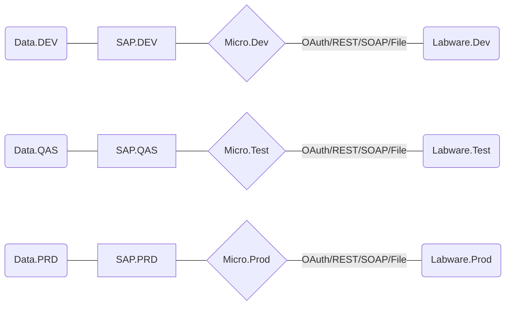

---

## TetraPak / TPM

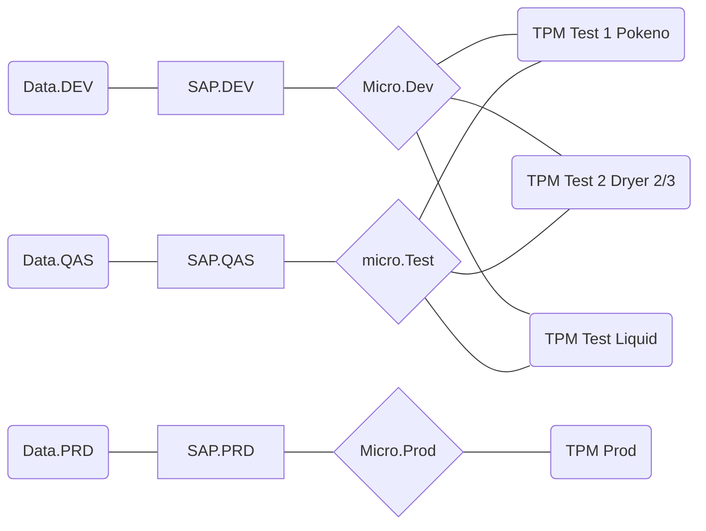

---

## Pack Machine / Packer

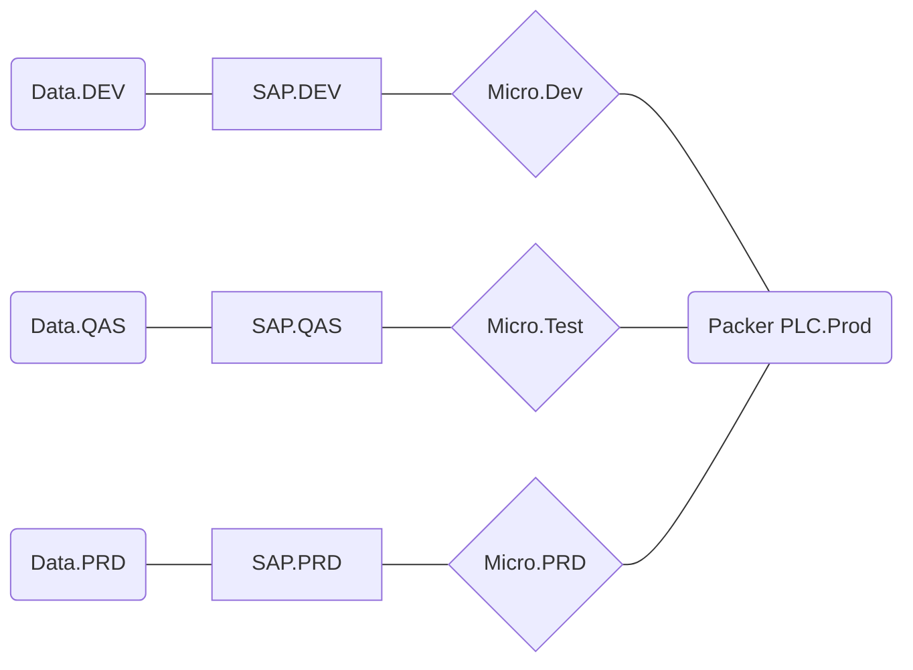

---

## ProDoc

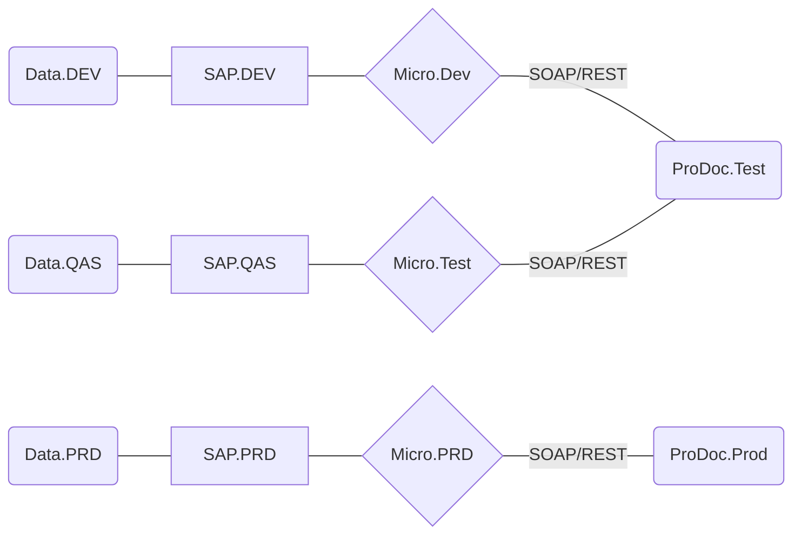
:::

---

## Bank / ANZ

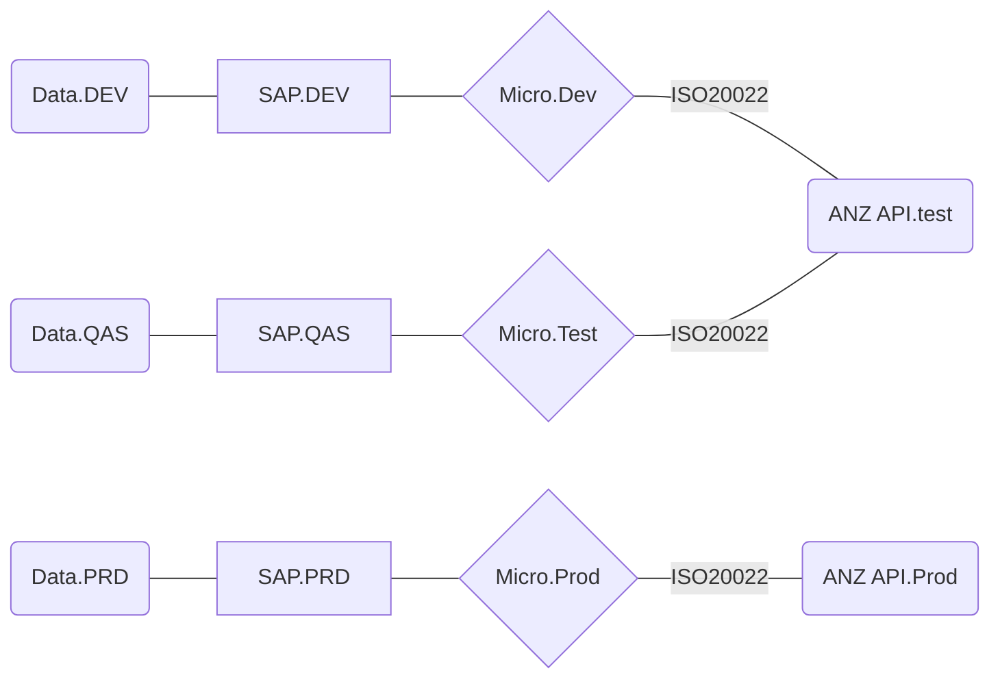

---

## MadCap

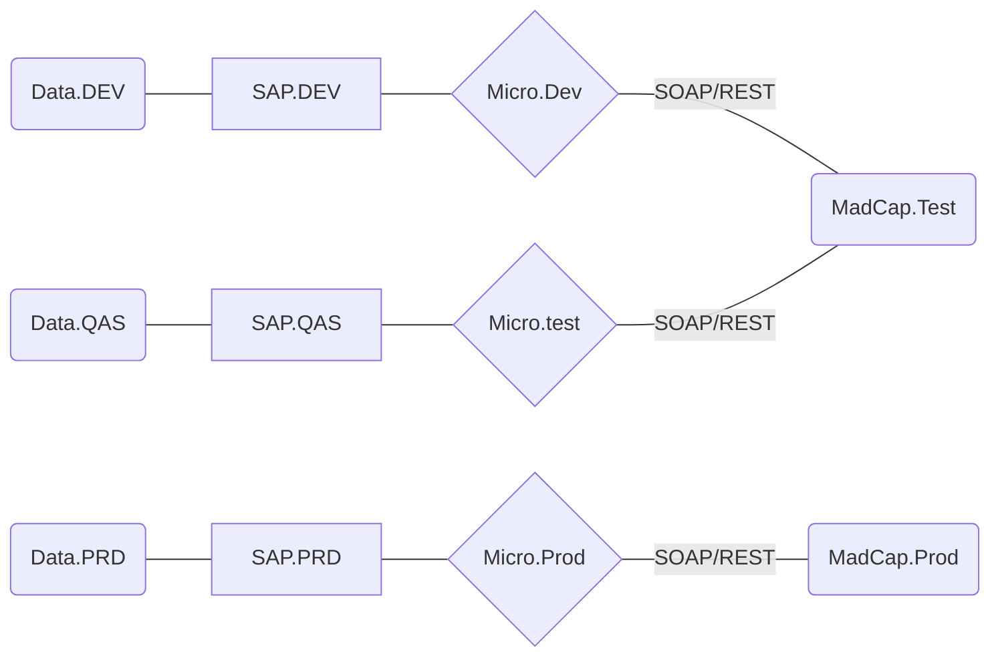

---

## EAM

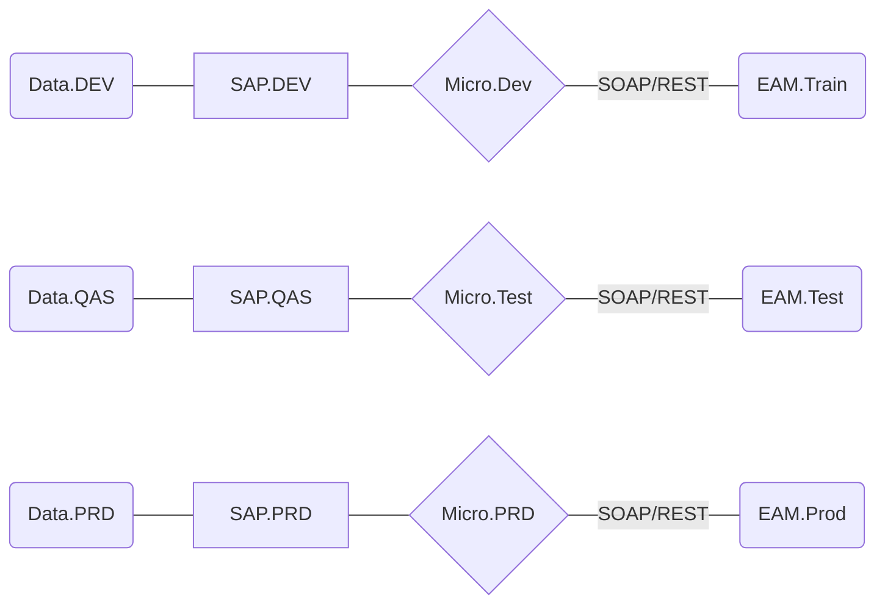
:::

---

## EDec / AP-eCert

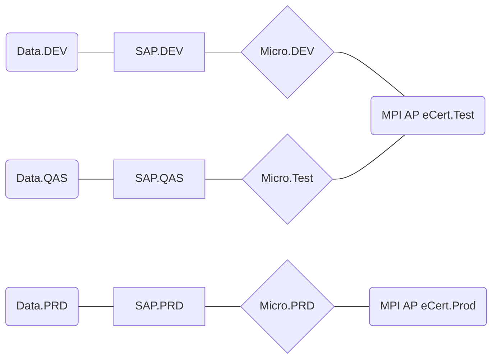
:::

---

## ISP

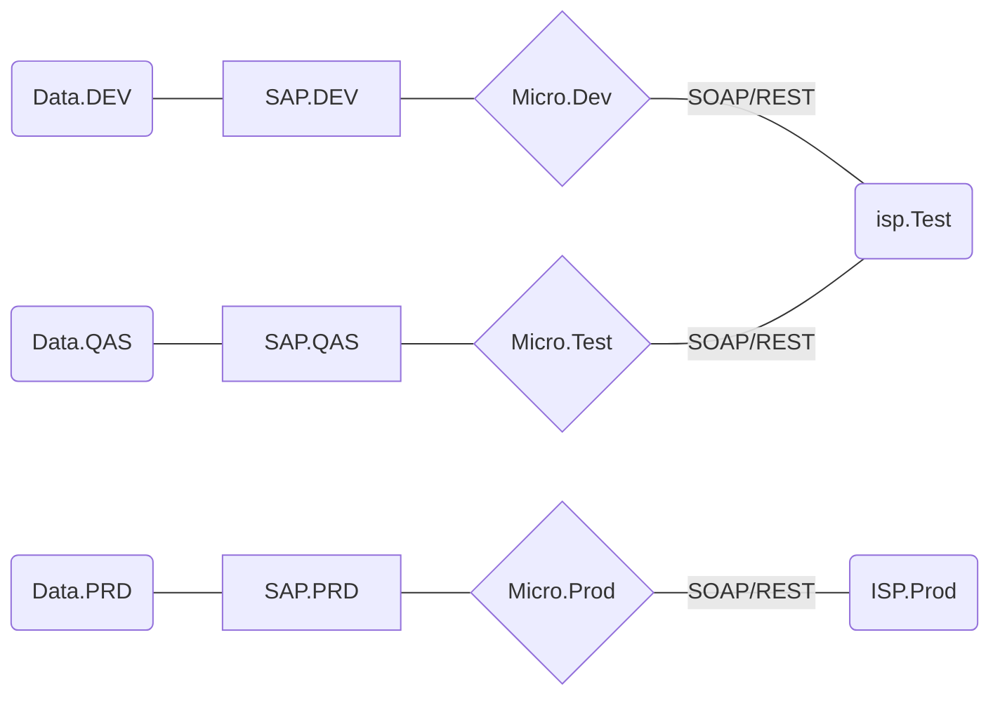
:::

---

## Oracle HCM

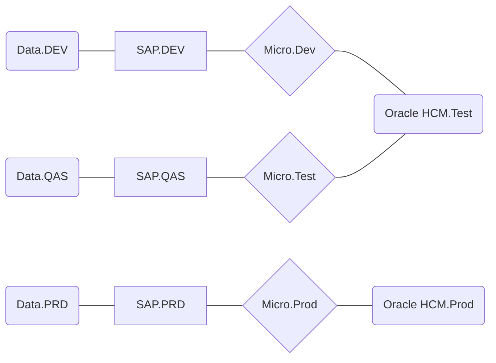
:::

---

## Cimcorp

::: mermaid
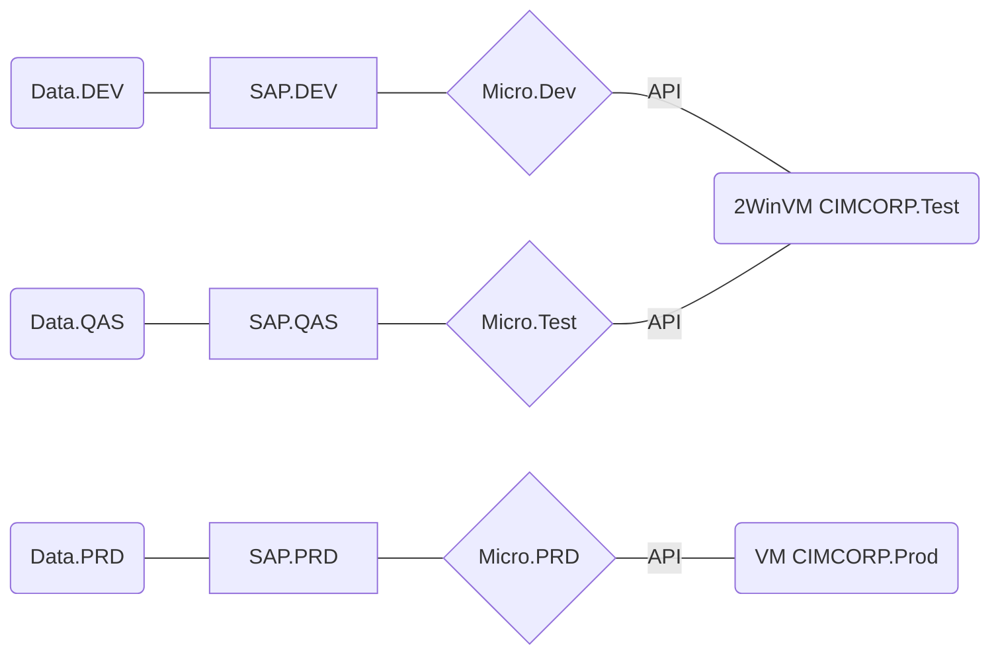
:::

---

## Palletiser Cans

### Tracked Environments

### About

Puts on pallets, not take it off.

### System Owner

Dominique Caldwell, Synlait Automation Team

### Details and Notes

Under investigation.

---

## FSSI / FoodStuffs South Island

https://synlait.atlassian.net/wiki/spaces/IT/pages/26280040/Business+process+description)

::: mermaid

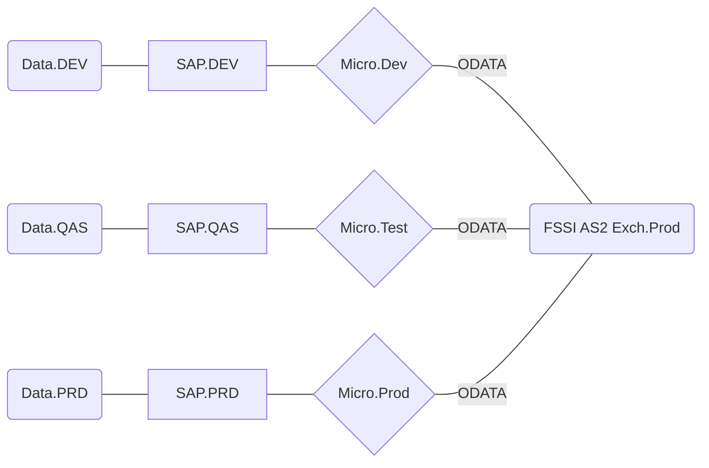
:::

---

## PayGlobal

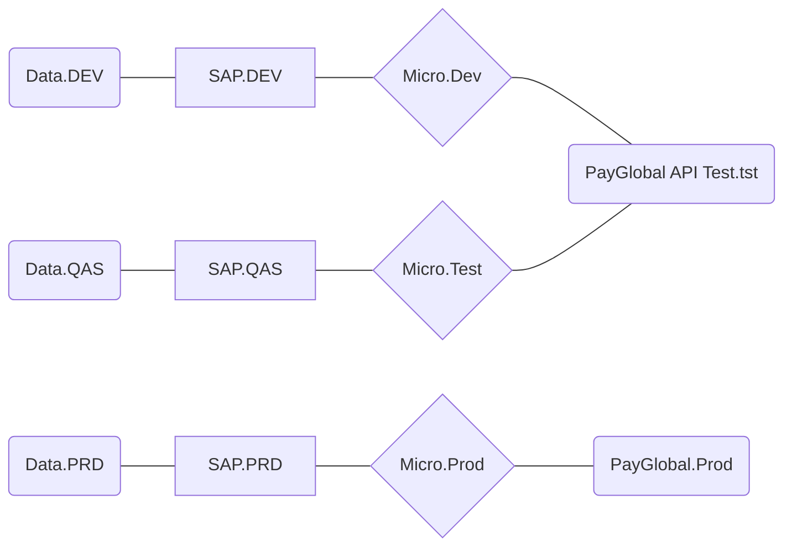

---

