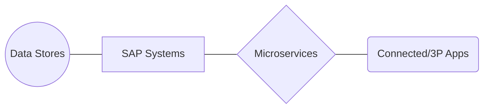

> This version is now behind the Word version. It needs to be updated upon final approval of the Word draft.

[[_TOC_]]

---

## Executive Summary

The Tumu Environment Strategy is the way in which each of the SAP Systems, connected (often 3rd party) components, and the enjoining Microservices will interact throughout the Tumu project. The SAP Strategy seeks to define and optimise the planning, tasks, and interconnectivity related to system deployment.

## Purpose

The Tumu Project is the elevation of an SAP/Azure installation to replace Synlait's current Infor M3 ERP. The purpose of this plan is to set out the pathway by which SAP and all of the connected applications that work with SAP will progress and interconnect from development to post-deployment. It seeks to establish what will be best practice for Synlait, allowing for the best mix of testing, cost, and productivity throughout the deployment lifecycle.

## Definitions

`System`: (Capitalised) A grouping of deployed hardware, software, and data that will provide a self-contained, complete installation.

`Environment`: Description of the current existence of a system (or ecosystem), often including a technical system state, client details, and data state.

`Microservice`: An application run as a service on Kubernetes; designed to do bespoke communication transformation between two applications, specifically SAP and a connected / 3rd party application. 

`Landscape`: The sum of all systems for the project, including all 3rd party applications.

`Greenfield`: 'Starting from scratch' with data cutting over from a set point in time.

`Brownfield` opposite of Greenfield. Data mapping from a current system in real-time is needed. This is not within the expectation of the Tumu project.

## Development Team

As part of deploying SAP, Synlait will be working with ZAG and EY to do the parts of work where they are experts. ZAG is doing the development work, and EY is doing business readiness. Each will play a part in how the landscape is designed and progressed. Synlait will employ the SAP best-practice three-system methodology, with specific tasks being carried out in the appropriate environment.

The Tumu and extended team is shown within this org chart:

---

## Landscape

The Landscape will be broadly defined as all of the systems that fit under the generic connective parts that will eventually be the structure of what goes into production:

::: mermaid

:::

### Data Stores

**S4 and BW4**

Data will be stored in two complimentary cloud-based services; S4/HANA, and BW4/HANA. Any time a data store is referenced, it will be the combination of these two services. The purpose of these two complimentary cloud environments is to optimise performance and cost. In short, S4/HANA is the area of higher performance and cost, and is intended for the use of mostly` current processes. BW4/HANA is a "cold store"; where larger volumes of data can be stored more cost effectively, but at the performance hit of less i/o speed.

It is worth noting that while both of these are used, it is the SAP instance that decides where data needs to be between the two, so in general, this split will be mostly invisible to any end-user.

The Data Migration team will be creating the transformations of data into each of the system data stores. These transformations will be scheduled for running in advance of each system's deployment. For more information on how data will arrive between systems and how it is transformed, see [EDW and Data Transformation](/Connections-Strategy/EDW-and-Data-Transformation)

> Open Item: The S4 and BW4 decision is pending final approval.

### SAP Systems

The SAP Systems will be installed by the ZAG Team in different instances:

| SAP Name | SAP System Description                                                  |
| -------- | ----------------------------------------------------------------------- |
| SAP.DEV  | This is the Development System, used to enhance and configure for dev   |
| SAP.QAS  | This is the Quality Assurance System, used mostly by Synlait            |
| SAP.PRD  | This is the Production System, used for limited testing, Dress Rehearsal     |
| SAP.PRE* | This is a "Pre-Production" System that _may_ be needed after Dress Rehearsal |

Each of these instances will have a 1:1 connection with a Data Store. The Data Stores will have a naming convention that ties them to the SAP System that will be connected, with the naming convention pending exploration of the data transformation Statement of Work.

### Microservices

The Integration Team are currently progressing the creation of a development environment for this connection using microservices. A proof-of-concept workshop occurred 01 May, 2020.

Microservices are individual applications that run as a service, and they are designed to facilitate the transport of messages between SAP and its connected 3rd party application. This will be done using Azure and Kubernetes for deployment. All of the microservices will communicate with SAP using JSON, and the communication with each connected application is dependent individually on what service it is connecting.

The Azure / Kubernetes environments will be the same throughout development, where each service is housed in either a development, test, or production environment. Specifically, each third party connection will have a single point of interface, and it will follow a "linear" structure. While multiple microservices may be used when passing messages to and from SAP to the target application, a set of connections will be dedicated as a flow for each permutation of SAP System and 3PA.

### Connected / 3rd Party Applications

The array of connected 3rd party components and additional SAP modules will be tracked in a separate strategy document set. (https://dev.azure.com/synlaitops/Tumu-environment-planning/_wiki/wikis/Deployment%20Strategies/8/Connections-Strategy)[https://dev.azure.com/synlaitops/Tumu-environment-planning/_wiki/wikis/Deployment%20Strategies/8/Connections-Strategy]

Each application has individual properties, and that drives the decision for how each of the microservices is constructed. Every 3rd party application will interface with a microservice, and in turn, the microservices will all connect to SAP in a similar way. Because each must be customised to the application, the strategies are tracked separately.

**Restrictions**

It is important that once a third-party environment has met the requirements of the microservice connections, and those specifications have been passed along to the Integration Team, any version update needs to be approved by the Integration Team. It will be critical to assess whether any future update contains a change in the way messages are transmitted or received. Any future update or upgrade may require an update with the associated microservice, and it should be a testing gate.

Specifically, any version number should be registered through Integration, and that the microservice version should be tied in a table with the thrid-party software version.

It is likely that this restriction already exists in some form with M3, but it should be continued, and that the Integration Team should be consulted with **every** connected upgrade indefinitely.

**Management**

Essentially, third-party environments are managed by the departments or areas they are assigned to, and they have their designated owners as listed under their specific information under its connection details. For each of those, management and maintenance are assigned out to the appropriate parties. It would be an advancement if there was a more unified maintenance location between all of the platforms, as each is now intricately intertwined between multiple systems within this project. To date, that maturity does not appear to exist, but should be a knock-on benefit of this project. A repository beyond simple wiki information should be consolidated prior to any future upgrades of the connected and third party applications.All changes and upgrades should be banked in separate repositories where applicable, in addition to the current CAB process.

---

## SAP Systems and Tasks

**Concept of Task Separation**

Each of the three SAP Systems should be tasked with a main list of responsibilities that are normally carried out within each System. As an obvious example, PRD should be prepared and deployed into production. But there are other tasks along the development lifecycle that should be defined when possible, as it will provide the best outcome for the task.

Changes are to be reviewed and then elevated for more thorough vetting prior to becoming a production system. This means that changes will be created and first tested in the SAP.DEV System, then elevated for a complete test set in SAP.QAS, and if passed, will then move into SAP.PRD. This ensures a safe transition, working towards the fewest errors/bugs making their way into a production-level system.

In other examples, it is more about what is not done. Development work should not occur on a quality assurance system, as this could jeopardise testing results. The appropriate delineation will provide independence, and thus more confidence in a safe deployment.

**Standard Operating Environment**

The SAP Environments within Azure is laid out to a specification created in the ZAG [SAP on Azure - Synlait Design Document v0.3.docx](/.attachments/SAP%20on%20Azure%20-%20Synlait%20Design%20Document%20v0.3-f58ecb68-69f0-41d9-8272-44ed61cc1fa1.docx) within Section 5. This goes on to explain in detail that the SAP environments will be deployed onto SUSE Linux as prescribed by SAP and Microsoft for Azure. 

Highlights for the deployment are that they will be "standardised" using the following best practices according to Microsoft. The Azure setup will follow the document "SAP on Microsoft Azure: Support prerequisites (SN 2015553)" as provided by Microsoft Azure documentation.

---

## System Tasks

The following division of tasks is **not** an absolute division of work. The concept of assigning these tasks are that they are likely best suited for each, but it is _not always_ required to be done on a specific System. Some tasks will be required, but those requirements will be stated within the _test cases and test plan_ for each of the tasks noted. This list is also not exhaustive, but seeks to be indicative.

**Concept of ownership** - Each System has an "owner", but it simply is a statement of who should be making decisions about the work within each system. Access to each system should contain some crossover. Specifically, it will be helpful for the Synlait team to be able to log into SAP.DEV, and conversely, ZAG developers will want to access SAP.QAS so they would be able to troubleshoot and diagnose. ZAG will provide the administration to them, as they are  instantiating the Systems. As soon as it is practical, access should be granted as appropriate in both directions, and as needed for EY.

### SAP.DEV / Development System Tasks

**Ownership: The DEV System is "owned" by the ZAG team**

The DEV System is up and running, as a part of ZAG's ongoing development for Synlait. This System is controlled and managed by the team at ZAG, so the Synlait team should be prevented from being at risk of causing any destructive actions that may affect ZAG development. **_It will be appropriate for Synlait team members to view and try work from time to time_**, but should be instructed in a way that provides any safeties needed for ZAG.

As ZAG creates enhancements and configurations it deems dev-complete, the DEV System will use the SAP tracking and transport application SAP Solution Manager (aka SolMan) to encapsulate the changes needed and then will shepherd the changes into the SAP.QAS System when this handoff is agreed to by the Synlait Test Team.

_Definition_ of `Dev-complete` or `dev-done`: the work necessary for creating and unit testing a feature is completed, and is considered ready to be passed to the Synlait Test Team. The ZAG team should have a high level of confidence in every transfer, and may have to demonstrate in a CAB session for approval. **It is ZAG's responsibility to notify the Synlait team of their work completion in a timely manner.**

| Task          | Timeline if applicable | Comment                                                                                                                                    |
| ------------- | ---------------------- | ------------------------------------------------------------------------------------------------------------------------------------------ |
| Development   | Entirety               | This is the primary purpose of the System                                                                                                  |
| Unit Testing  | Entirety               | Unit Testing should be completed on DEV to determine completion; successful results are needed before elevation to SAP.QAS                 |
| Demonstration | Stochastic             | Act as a demonstration area to show specific functions or enhancements ahead of change acceptance                                          |
| Integration   | Entirety               | Ensure that an appropriate connection is always maintained with the Microservices package; http 200 to all service addresses at all times. |

---

### SAP.QAS / Quality Assurance and System Testing Tasks

**Ownership: The QAS System is "owned" by the Synlait Testing Team**

The QAS System is yet to be started, but will be created by ZAG. As this is a testing System, ZAG will generally be responsible for the transport of changes into the system, under observation from the Synlait testing team. This will ensure that transportation will result in a good result, and that the SAP.QAS environment remains relatively "clean".

It is important to note that while "ownership" belongs to the Synlait Testing Team, it falls to ZAG under the Statement of Work to maintain the System environment. This may include maintenance from time to time, and **it is the responsibility of ZAG to perform the maintenance and communicate the timings in advance to the Synlait Testing Team.** Any QAS System Downtime must be communicated and accepted by the Synlait Test Team.

| Task                      | Timeline if applicable | Comment                                                                                                           |
| ------------------------- | ---------------------- | ----------------------------------------------------------------------------------------------------------------- |
| Functional Verification   | Entirety               | Testing whether the enhancement and/or configuration change meet its expectations                                 |
| Month-End / Transactional | Entirety               | Validation of processes that are time-oriented against other functions.                                           |
| Downstream / API          | Entirety               | Check that the connections between SAP and the Microservices that connect with other API systems work as expected |
| Training                  | From Dress Rehearsal         | Training scenarios without affecting production data                                                              |
| Data Conversion           | Entirety               | Ensuring that the Microservice transforms are working and providing messages as expected                          |
| Security / Penetration      | Stochastic             | Verify system has been appropriately hardened                                                                     |

**QAS is the only system where Synlait will intentionally maintain multiple Clients**

The Digital Design document lays out the concept of Clients. In Production, there will be a single Client, but within QAS, multiple Clients will be necessary to maintain both a Testing and a Training environment, noted as clients 100 and 300, respectively. Clients are essentially "walled off" in a very similar manner as a shared web-hosting environment; the Clients share the base SAP installation but are otherwise entirely identical.

This does bring up a risk (See: R101) whereby the architecture has a limitation. Microservices can only connect to one place at a time (by best practice). This means that if the QAS microservices are necessary for testing and training at the same time, they may present a conflict. There is the potential to abridge training (or demos, or whatever additional Client), thus that the microservices are not needed, but if they are needed, testing may not be able to be done at the same time. It won't be necessarily impossible, but coexistance will require a minimum of solid coordination and management, and still could cause false-positives under test.

---

### SAP.PRD / Production Only Changes

**Ownership: The PRD System is "owned" by the Tumu Change Advisory Board**

The PRD System will be brought online as what could first be considered a "Pre-Production System". From the time the PRD System gets instantiated to the gate where it must be cleared for a clean deployment, PRD will function as a testing area, mostly for areas of performance and security testing and verification, run by the Synlait Test Team. ZAG will continue to maintain the System as per the Statement of Work.

ZAG will again be responsible for the transport of changes to PRD, but a few additional rules will apply to ensure best outcomes. One example will be a requirement that the packages deployed to QAS are not modified when deployed to PRD, or any production-level system. These governance practices will be laid out in Change Elevation Process. The Transport Management System will prevent any of the changes being impacted, but the elevation into production **must** be done with the consent of the Synlait Test Team. This means that _changes should not be set to "Handed over to Release" unless the change has cleared its CAB approval_.

IMPORTANT: When the PRD System is manoeuvred into Dress Rehearsal for deployment, the tasks assigned to a "pre-production" system must be reassigned. This may entail bringing forth a "PREPRD" or "PRD2", etc., but this needs to be determined based around business needs, particularly in the areas of integration.

Also, once the PRD system goes Dress Rehearsal, ownership is transferred permanently to IT Operations.

> At the appropriate time, determine whether to go to a 4-System Landscape, or continue with a more release-centric QAS System.

| Task                         | Timeline if applicable | Comment                                                                                                                                                                         |
| ---------------------------- | ---------------------- | ------------------------------------------------------------------------------------------------------------------------------------------------------------------------------- |
| Production Deployment        | From Dress Rehearsal         | Once the final Dress Rehearsal is started, the PRD system is reserved as the main System of use, and is governed by production-level SLA standards.                                   |
| Performance Qualification    | Pre-Dress Rehearsal          | Performance qualification needs to be achieved as a prerequisite to deployment. Does it perform as fast as expected?                                                            |
| Operational Qualification    | Pre-Dress Rehearsal          | Operational qualification needs to be achieved as a prerequisite to deployment. Does it behave as expected?                                                                     |
| Infrastructure Qualification | Pre-Dress Rehearsal          | Infrastructure qualification needs to be achieved as a prerequisite to deployment. Does the Azure and HANA connections work as expected?                                        |
| System Integration           | Pre-Dress Rehearsal          | Do all of the connections between systems and components work properly in a pre-production situation?                                                                           |
| Security / User Profiles     | From Data Connection   | Are the user accounts performing as expected, with the least-necessary permissions?                                                                                             |
| Security / Penetration       | Pre-Dress Rehearsal          | Before the PRD goes live, it is important to verify that all areas are opened for necessary reasons only. This includes ensuring all firewalling and whitelisting is completed. |

---

## Appendix

### SAP.PRE / Preproduction server to be considered

**The case for and against a Preprod System**

By definition, the PRD System will be a pre-production system prior to its Dress Rehearsal and Deployment into general use by the company. Therefore, it is particularly well suited for the testing and verification of certain tasks, such as performance testing, security validation, and penetration testing. By performing these activities in advance of Dress Rehearsal, the overall environment can be assured that the setup and integrity of the system and its cloud infrastructure will be sound. However, once this environment enters Dress Rehearsal, these activities will be halted, as they can affect the stability of the soon-to-be production system.

Therefore, it will be important to regain the ability to perform these tasks, as the peripheral components will be deployed subsequently to the first core deployment. The ability to use the QAS system under a separate client, or the PRD system with a separate client, must be assessed for suitability. If they are _not suitable_ for these tasks, consideration should be given to uplifting a fourth PRE System.

However, if this proves cost-prohibitive, or can be implemented sufficiently with the existing three tiers, a PRE system may be surplus for testing and deployment purposes. It also may be unneeded if Synlait chooses the "big bang" deployment go-live, as in that case, it's possible to retrofit the QAS system into one where it is focused on fixes for production in the "Hypercare" stage.

This needs to be decided upon with enough time before Dress Rehearsal to allow a build if needed by ZAG.

> Open Item: Will it be appropriate to build a PRE / Preproduction System to step into the role relinquished by PRD?

